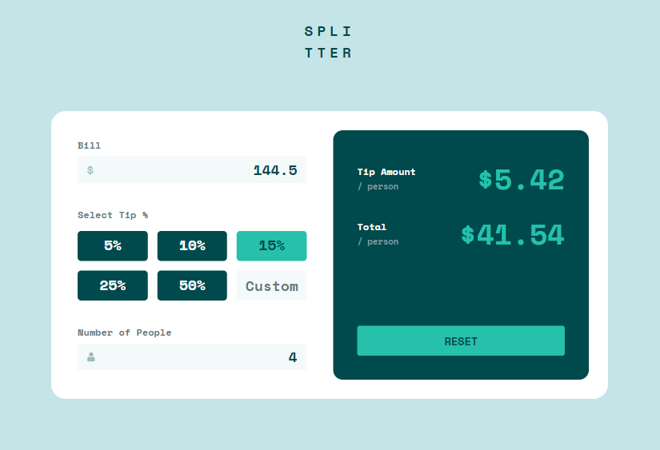

Jayvon Khuth

4/2/2024

Tip Calculator

I created a website that's able to calculate the total tip amount per person, and total amount of money each person would need to pay based off of the total bill. I created this website using HTML, CSS, JavaScript/Typescript, and for the frameworks I used Next JS & Tailwind CSS. There was no backend needed for this website, everything was handled in the frontend. This project was fairly simple, I used state variables/functions, components, props and utilized events like onClick, onFocus, etc.


Peer Reviewer: Joseph Poncini

Peer Review: Overall the website looks like the prototype in both mobile and desktop so good job. I noticed a few areas that can be improved so I'll try to list them out in some sort of organized manner

- Interface: 
    - On mobile the bottom right corner of the white container shouldn't be rounded. Quick easy fix

- Functionality: 
    - I noticed the "Can't be zero" message pops up as soon as I click a tip button but beore I've even clicked the bill button, I would probably have it only pop up if the user has given an input for both bill && tip but not for the number of people.
    - The custom button you have functioning as a Custom tip "percent" button. Usually at restaraunts I think it would more likely serve as a custom tip "amount" vs a percent. You can check with the TAs on that though since it's a little ambiguous from the prototype.
    - More niche, but technically you can't have a decimal number of people, so I would restrict the input to only be whole numbers and likewise for the bill only take values up to 2 decimal places. E.g. $5.50 is fine but $5.551 is not 

- Organization:
    - In your code, you have a lot of repeated functions that are only slightly different for the tip buttons. I would simplify them down to just one function that takes in a "tip value" parameter and maybe map through an array of values to make all of your buttons

Vercel Link: https://tipcalculator-ashy.vercel.app/


This is a [Next.js](https://nextjs.org/) project bootstrapped with [`create-next-app`](https://github.com/vercel/next.js/tree/canary/packages/create-next-app).

## Getting Started

First, run the development server:

```bash
npm run dev
# or
yarn dev
# or
pnpm dev
# or
bun dev
```

Open [http://localhost:3000](http://localhost:3000) with your browser to see the result.

You can start editing the page by modifying `app/page.tsx`. The page auto-updates as you edit the file.

This project uses [`next/font`](https://nextjs.org/docs/basic-features/font-optimization) to automatically optimize and load Inter, a custom Google Font.

## Learn More

To learn more about Next.js, take a look at the following resources:

- [Next.js Documentation](https://nextjs.org/docs) - learn about Next.js features and API.
- [Learn Next.js](https://nextjs.org/learn) - an interactive Next.js tutorial.

You can check out [the Next.js GitHub repository](https://github.com/vercel/next.js/) - your feedback and contributions are welcome!

## Deploy on Vercel

The easiest way to deploy your Next.js app is to use the [Vercel Platform](https://vercel.com/new?utm_medium=default-template&filter=next.js&utm_source=create-next-app&utm_campaign=create-next-app-readme) from the creators of Next.js.

Check out our [Next.js deployment documentation](https://nextjs.org/docs/deployment) for more details.
